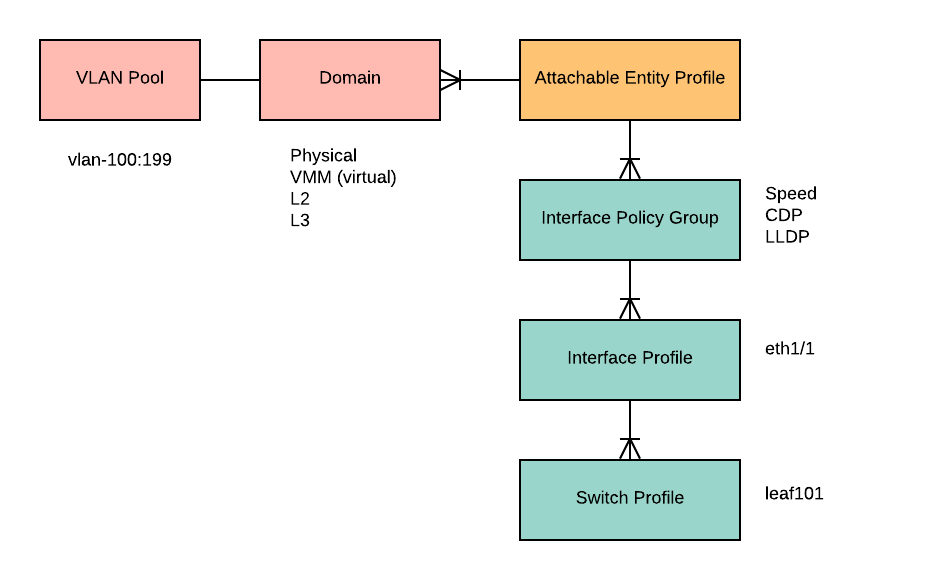
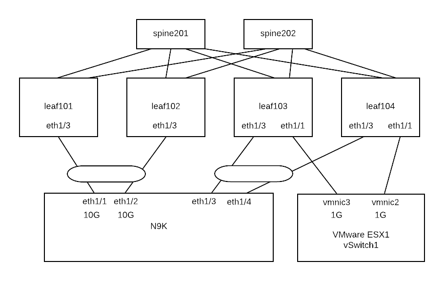

Access Policies
===============

Once the underlay infrastructure is established (VRF overlay-1 and IS-IS are deployed to leaf and spine switches), 
now we are ready to configure the access policies for front panel ports of leaf switches.

Access policies define the connectivity from external devices to ACI leaf switches 
such as interfaces, VLANs, CDP, LLDP, etc.

Attachable Entiry Profile is used for linking many to many relationships between
Domains and Interface Policy Groups.

A domain determines the type of bridge domain that is deployed to the leaf port.

Interface Policy Group
~~~~~~~~~~~~~~~~~~~~~~

There are several types of interface policy groups:

* Physical Ports
* Port Channels
* Virtual Port Channels

VPC
~~~

To find out which Interface Policy Group is used for a VPC:

.. code-block:: console

	leaf101# show vpc extended 
	Legend:
			(*) - local vPC is down, forwarding via vPC peer-link

	vPC domain id                     : 100 
	Peer status                       : peer adjacency formed ok      
	vPC keep-alive status             : Disabled                      
	Configuration consistency status  : success 
	Per-vlan consistency status       : success                       
	Type-2 consistency status         : success 
	vPC role                          : primary                       
	Number of vPCs configured         : 1   
	Peer Gateway                      : Disabled
	Dual-active excluded VLANs        : -
	Graceful Consistency Check        : Enabled
	Auto-recovery status              : Enabled (timeout = 240 seconds)
	Operational Layer3 Peer           : Disabled

	vPC Peer-link status
	---------------------------------------------------------------------
	id   Port   Status Active vlans    
	--   ----   ------ --------------------------------------------------
	1           up     -                                                      

	vPC status
	---------------------------------------------------------------------------------
	id   Port   Status Consistency Reason               Active vlans Bndl Grp Name
	--   ----   ------ ----------- ------               ------------ ----------------
	1    Po1    up     success     success              -            UplinkForN9KVPC1 <<< Interface Policy Group      

	leaf101# show port-channel extended    
	Flags:  D - Down        P - Up in port-channel (members)
	        I - Individual  H - Hot-standby (LACP only)
	        s - Suspended   r - Module-removed
	        S - Switched    R - Routed
	        U - Up (port-channel)
	        M - Not in use. Min-links not met
	        F - Configuration failed
	-----------------------------------------------------------------------------
	Group Port-       BundleGrp                Protocol  Member Ports
	      Channel
	-----------------------------------------------------------------------------
	1     Po1(SU)     UplinkForN9KVPC1         NONE      Eth1/3(P)    

To check LACP messages:

.. code-block:: console

	leaf101# show lac interface ethernet 1/3 | grep -i pdu
	  PDUs sent: 0 
	  PDUs rcvd: 0 

Common Problems
---------------

* Speed mismatch
* MCP - Duplicate VLAN
* A VPC policy group represent 1 virtual port-channel. 
* LACP Mismatch

Reference
---------

* How To Create VPC https://www.cisco.com/c/en/us/td/docs/switches/datacenter/aci/apic/sw/1-x/Operating_ACI/guide/b_Cisco_Operating_ACI/b_Cisco_Operating_ACI_chapter_0110.html
