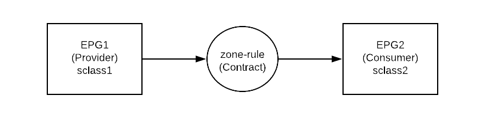

Contract
========

In order for different EPGs to be able to communicate, they must have a contract.
Server provides the contract and Client consumes a contract.

Each EPG has a source class. To find out the source class of an EPG:

For example, the vlan encap for an EPG is vlan-100.

.. code-block:: console

	leaf103# show vlan extended | grep vlan-100
	 8    enet  CE         vlan-100  

		leaf103# show vlan id 8

	 VLAN Name                             Status    Ports                           
	 ---- -------------------------------- --------- ------------------------------- 
	 8    tshoot:tshoot-ap:A-epg           active    Eth1/3, Po1 

	 VLAN Type  Vlan-mode  
	 ---- ----- ---------- 
	 8    enet  CE          

In above example, encap vlan-100 has been mapped to ACI platform independent (PI) vlan 8.

Let us check the sclass ID that will be used in zone-rule (contract):

.. code-block:: console

	leaf103# vsh_lc
	module-1# show system internal eltmc info vlan 8

             vlan_id:              8   :::      hw_vlan_id:             39
           vlan_type:        FD_VLAN   :::         bd_vlan:              7
   access_encap_type:         802.1q   :::    access_encap:            100
            isolated:              0   :::   primary_encap:              0
   fabric_encap_type:          VXLAN   :::    fabric_encap:           8192
              sclass:          49156   :::           scope:              4
             bd_vnid:           8192   :::        untagged:              0
     acess_encap_hex:           0x64   :::  fabric_enc_hex:         0x2000
     pd_vlan_ft_mask:           0x4f
    fd_learn_disable:              0
        bcm_class_id:             16   :::  bcm_qos_pap_id:           1024
          qq_met_ptr:             18   :::       seg_label:              0
      ns_qos_map_idx:              0   :::  ns_qos_map_pri:              1
     ns_qos_map_dscp:              0   :::   ns_qos_map_tc:              0
        vlan_ft_mask:         0x7830

      NorthStar Info:
           qq_tbl_id:           1441   :::         qq_ocam:              0
     seg_stat_tbl_id:              0   :::        seg_ocam:              0
     ::::

We can see that the source class (sclass) is 49156 for EPG tshoot:tshoot-ap:A-epg.

To know the sclass of an external EPG of L3out:

.. code-block:: console

	leaf103# vsh_lc
	module-1# show system internal aclqos prefix | grep 2949120
	Vrf Vni Addr           Mask     Scope Class  Shared Remote

	======= ============== ======== ===== ====== ====== ======
	2949120 0::/0 0::/0 4     15     FALSE FALSE
	2949120 0.0.0.0        ffffffff 4     15     FALSE FALSE
	2949120 9.9.9.9        0        4     16388  FALSE FALSE

From above, we can see that ip address 9.9.9.9/32 has sclass 16388.

Contracts exist in VRF. To know the VRF ID, you can run the following command:

.. code-block:: console

	leaf103# show system internal epm vrf all

	+--------------------------------+--------+----------+----------+------+--------
	               VRF                  Type    VRF vnid  Context ID Status Endpoint
	                                                                          Count 
	+--------------------------------+--------+----------+----------+------+--------
	 black-hole                       Tenant   16777200   3          Up     0       
	 tshoot:tshoot-vrf                Tenant   2949120    6          Up     1       
	 overlay-1                        Infra    16777199   4          Up     2       

To check the zoning rule of a contract that is applied:

.. code-block:: console

	leaf103# show zoning-rule scope 2949120 | grep 49156
	4186            16387           49156           6               enabled         2949120         permit                              fully_qual(6)  

	leaf103# show zoning-filter filter 6
	FilterId  Name          EtherT      ArpOpc      Prot        MatchOnlyFrag Stateful SFromPort   SToPort     DFromPort   DToPort     Prio        Icmpv4T     Icmpv6T     TcpRules   
	========  ===========   ======      =========   =======     ======        =======  =======     ====        ====        ====        =========   =======     ========    ========   
	6         6_0           ip          unspecified tcp         no            no       unspecified unspecified http        http        dport       unspecified unspecified            

To get the hit statistics of a particular filter:

.. code-block:: console

	leaf103# show system internal policy-mgr stats | grep 4186
	Rule (4186) DN (sys/actrl/scope-2949120/rule-2949120-s-16387-d-49156-f-6) Ingress: 0, Egress: 0, Pkts: 0  RevPkts: 0

To check whether policy enforcement process denies:

.. code-block:: console

	leaf103# show logging ip access-list internal packet-log deny
	[ Wed Mar 21 00:10:53 2018 434710 usecs]: CName: tshoot:tshoot-vrf(VXLAN: 2949120), VlanType: FD_VLAN, Vlan-Id: 5, SMac: 0x641225750331, DMac:0x0022bdf819ff, SIP: 9.9.9.9, DIP: 192.168.200.254, SPort: 0, DPort: 0, Src Intf: port-channel1, Proto: 1, PktLen: 98

In above example, a packet with source IP 9.9.9.9 is denied to access destination IP 192.168.200.254

Reference
----------
#. Verify Contracts and Rules in the ACI Fabric https://www.cisco.com/c/en/us/support/docs/cloud-systems-management/application-policy-infrastructure-controller-apic/119023-technote-apic-00.pdf
#. Working with Contracts https://www.cisco.com/c/en/us/td/docs/switches/datacenter/aci/apic/sw/1-x/Operating_ACI/guide/b_Cisco_Operating_ACI/b_Cisco_Operating_ACI_chapter_01000.pdf