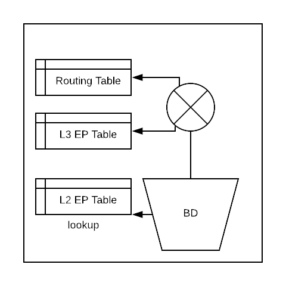

End Point Learning
==================

In ACI, the lookup is done in this order:

#. L2 EP table 
#. If it is a routed traffic, L3 EP table 
#. If not found in the L3 EP table, routing table

Let us look at this below example.

First, find out the platform independent vlan that is mapped for vlan-199.

.. code-block:: console

	leaf103# show vlan extended | grep vlan-199
	 5    enet  CE         vlan-199    

We can see that vlan-199 is mapped to vlan 5.

Let us confirm that vlan 5 corresponds to the correct EPG:

.. code-block:: console

	leaf103# show vlan id 5

	 VLAN Name                             Status    Ports                           
	 ---- -------------------------------- --------- ------------------------------- 
	 5    tshoot:tshoot-ap:B-epg           active    Eth1/3, Po1 

	 VLAN Type  Vlan-mode  
	 ---- ----- ---------- 
	 5    enet  CE 

To check the content of end point table for the EPG:

.. code-block:: console

	leaf103# show endpoint vlan 5   
	Legend:
	 s - arp              O - peer-attached    a - local-aged       S - static          
	 V - vpc-attached     p - peer-aged        M - span             L - local           
	 B - bounce           H - vtep            
	+-----------------------------------+---------------+-----------------+--------------+-------------+
	      VLAN/                           Encap           MAC Address       MAC Info/       Interface
	      Domain                          VLAN            IP Address        IP Info
	+-----------------------------------+---------------+-----------------+--------------+-------------+
	5/tshoot:tshoot-vrf                        vlan-199    6412.2575.0334 LpV                       po1 
	5                                          vlan-199    6412.2575.0331 LpV                       po1
	tshoot:tshoot-vrf                          vlan-199     192.168.199.2 LV                        po1

	+------------------------------------------------------------------------------+
	                             Endpoint Summary
	+------------------------------------------------------------------------------+
	Total number of Local Endpoints     : 2   
	Total number of Remote Endpoints    : 0   
	Total number of Peer Endpoints      : 0   
	Total number of vPC Endpoints       : 2   
	Total number of non-vPC Endpoints   : 0   
	Total number of MACs                : 2   
	Total number of VTEPs               : 0   
	Total number of Local IPs           : 1   
	Total number of Remote IPs          : 0   
	Total number All EPs                : 2   

To show more details about a local end point:

.. code-block:: console

	leaf103# show system internal epm endpoint mac 6412.2575.0331

	MAC : 6412.2575.0331 ::: Num IPs : 1
	IP# 0 : 192.168.199.2 ::: IP# 0 flags :  
	Vlan id : 5 ::: Vlan vnid : 8291 ::: VRF name : tshoot:tshoot-vrf
	BD vnid : 16285610 ::: VRF vnid : 2949120
	Phy If : 0x16000000 ::: Tunnel If : 0
	Interface : port-channel1
	Flags : 0x80005c25 ::: sclass : 16387 ::: Ref count : 5
	EP Create Timestamp : 03/20/2018 21:27:35.632579
	EP Update Timestamp : 03/20/2018 21:54:44.324243
	EP Flags : local|vPC|peer-aged|IP|MAC|host-tracked|sclass|timer|
	::::

To show the routing table:

.. code-block:: console

	leaf103# show ip route vrf tshoot:tshoot-vrf  
	IP Route Table for VRF "tshoot:tshoot-vrf"
	'*' denotes best ucast next-hop
	'**' denotes best mcast next-hop
	'[x/y]' denotes [preference/metric]
	'%<string>' in via output denotes VRF <string>

	192.168.199.0/24, ubest/mbest: 1/0, attached, direct, pervasive
	    *via 10.0.64.64%overlay-1, [1/0], 00:35:37, static, tag 4294967295
	192.168.199.254/32, ubest/mbest: 1/0, attached, pervasive
	    *via 192.168.199.254, vlan4, [1/0], 00:35:37, local, local
	192.168.200.0/24, ubest/mbest: 1/0, attached, direct, pervasive
	    *via 10.0.64.64%overlay-1, [1/0], 00:00:06, static, tag 4294967295

