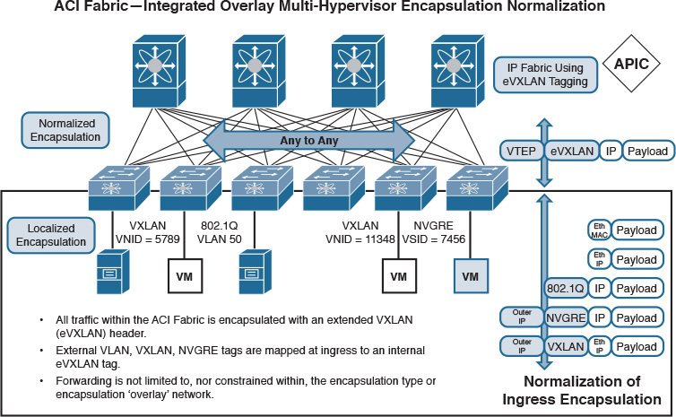
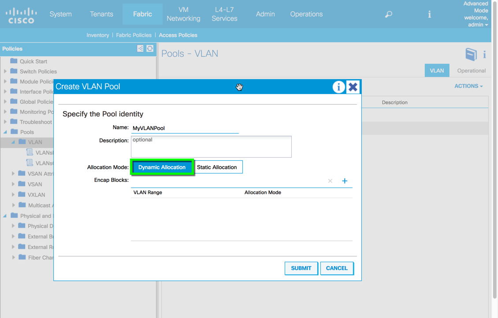
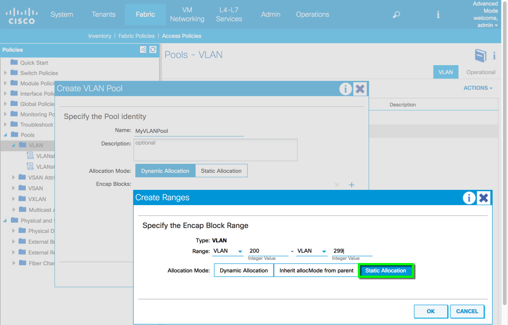
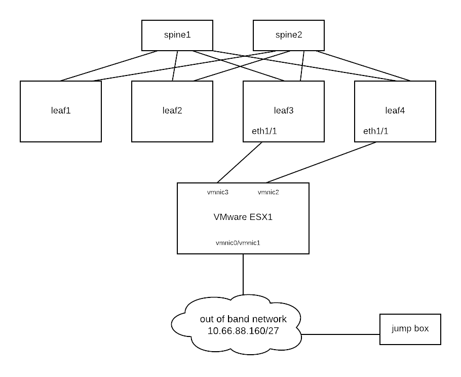

End Point Group
===============

EPG classification can be based on:

* Access (untagged)  = Access VLAN
* Source IP address
* Trunk = Trunk
* Access (802.1p) = Native VLAN
* NVGRE
* VXLAN

In this lab, we will use VLAN as an EPG classifier. Therefore, we will need to create a VLAN pool

VLAN Pool Creation
------------------

When you create a VLAN pool, it is a good practice to set allocation mode to dynamic.

Then when you add an encap block, you can choose either static or dynamic.
In that way, you will have flexibility to add both dynamic and static encap blocks.
Dynamic encap blocks are used for Virtual Machine Manager (VMM) domain.

Make sure VLAN pools do not have overlapping vlans. The reason is that ACI floods STP Bridge Protocol Data Units (BPDUs) to the VXLAN network identifier (VNID) assigned to the FD VLAN. VNID is assigned through the VLAN pool so encapsulation has to be part of same VLAN pool to be in part of same STP domain. Otherwise STP BPDU can be dropped by ACI.

Static binding
--------------

We can statically classify EPG by assigning an encap vlan on leaf ports.
In below example, port eth1/1 on leaf103 is statically bound with encap vlan 100.
That means any incoming traffic with vlan tag 100 is classified as EPG "tshoot-epg".

.. code-block:: console

	leaf103# show endpoint
	Legend:
	 s - arp              O - peer-attached    a - local-aged       S - static          
	 V - vpc-attached     p - peer-aged        M - span             L - local           
	 B - bounce           H - vtep            
	+-----------------------------------+---------------+-----------------+--------------+-------------+
	      VLAN/                           Encap           MAC Address       MAC Info/       Interface
	      Domain                          VLAN            IP Address        IP Info
	+-----------------------------------+---------------+-----------------+--------------+-------------+
	8                                          vlan-100    0050.5696.609a L                      eth1/1
	tshoot:tshoot-vrf                          vlan-100     192.168.1.101 L                      eth1/1
	overlay-1                                                  10.0.32.92 L                         lo0
	3/overlay-1                          vxlan-16777209    d8b1.9061.1e65 L                     eth1/46

	leaf103# show vlan id 8

	 VLAN Name                             Status    Ports                           
	 ---- -------------------------------- --------- ------------------------------- 
	 8    tshoot:tshoot-ap:tshoot-epg      active    Eth1/1 

	 VLAN Type  Vlan-mode  
	 ---- ----- ---------- 
	 8    enet  CE         

	 leaf103# show system internal epm vlan 8  

	+----------+---------+-----------------+----------+------+----------+-----------
	   VLAN ID    Type      Access Encap     Fabric    H/W id  BD VLAN    Endpoint  
	                        (Type Value)     Encap                          Count   
	+----------+---------+-----------------+----------+------+----------+-----------
	 8            FD vlan 802.1Q        100 8192       7      7          1         

In above example, encap vlan-100 has been mapped to ACI platform independent (PI) vlan 8 which is mapped to vxlan-8192.

Let us check the sclass ID that will be used in zone-rule (contract):

.. code-block:: console

	leaf103# vsh_lc
	vsh_lc
	module-1# show system internal eltmc info vlan 8

	             vlan_id:              8   :::      hw_vlan_id:              7
	           vlan_type:        FD_VLAN   :::         bd_vlan:              7
	   access_encap_type:         802.1q   :::    access_encap:            100
	            isolated:              0   :::   primary_encap:              0
	   fabric_encap_type:          VXLAN   :::    fabric_encap:           8192
	              sclass:          16386   :::           scope:              4
	             bd_vnid:           8192   :::        untagged:              0
	     acess_encap_hex:           0x64   :::  fabric_enc_hex:         0x2000
	     pd_vlan_ft_mask:           0x4f
	    fd_learn_disable:              0
	        bcm_class_id:             16   :::  bcm_qos_pap_id:           1024
	          qq_met_ptr:              2   :::       seg_label:              0
	      ns_qos_map_idx:              0   :::  ns_qos_map_pri:              1
	     ns_qos_map_dscp:              0   :::   ns_qos_map_tc:              0
	        vlan_ft_mask:         0x7830

	      NorthStar Info:
	           qq_tbl_id:           1441   :::         qq_ocam:              0
	     seg_stat_tbl_id:              0   :::        seg_ocam:              0
	::::

We can see that the sclass is 8192 for EPG tshoot:tshoot-ap:tshoot-epg.

Reference
---------
#. CNA Data Center DCICT 200-155 Official Cert Guide by Ahmed Afrose et. al.
#. ACI Operation with L2 Switches and Spanning Tree Link Types https://www.cisco.com/c/en/us/support/docs/cloud-systems-management/application-policy-infrastructure-controller-apic/211236-ACI-operation-with-L2-switches-and-Spann.html

 