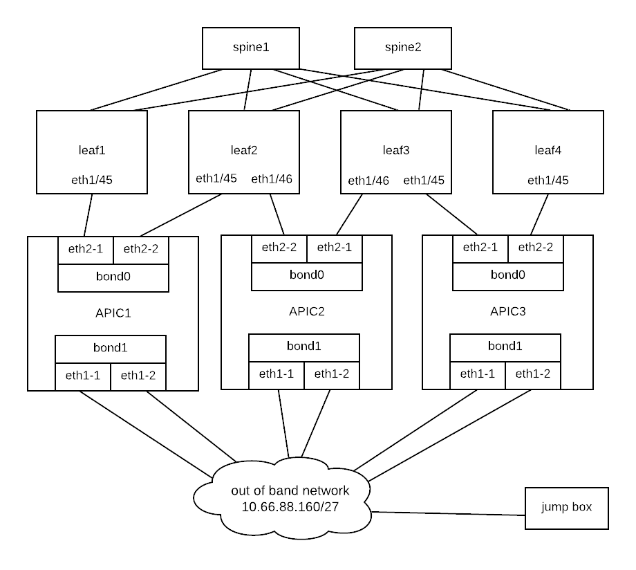
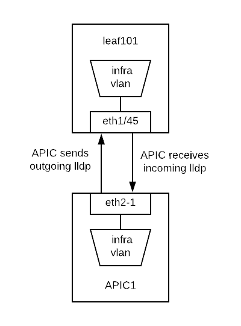
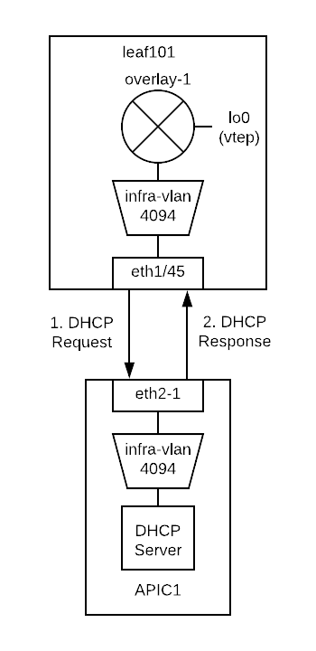
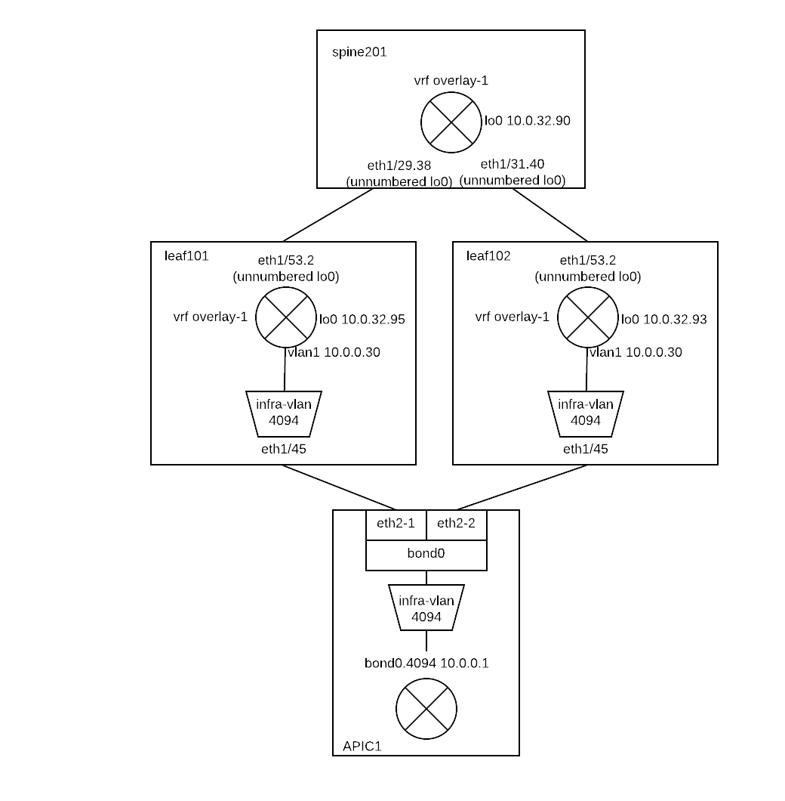

Fabric Discovery
===================

The ACI fabric is brought up in a cascading manner, starting with the leaf nodes that are directly attached to the APIC. LLDP and control-plane IS-IS convergence occurs in parallel to this boot process. The ACI fabric uses LLDP- and DHCP-based fabric discovery to automatically discover the fabric switch nodes, assign the infrastructure VXLAN tunnel endpoint (VTEP) addresses.

APIC Cluster Connectivity
----------------------------

Erase Configuration
----------------------

APIC Config Erase
~~~~~~~~~~~~~~~~~

To erase configuration of APIC so that we can re-setup APIC:

Sometimes KVM cannot launch because of Java issues. 
If you encounter such a problem, you can use Serial Over LAN as follows.

SSH to CIMC of the APIC:

.. code-block:: console

   ssh admin@<cimc IP addr>

Enable the Serial Over LAN (SoL):

.. code-block:: console

   cimc# 
   cimc# scope sol
   cimc /sol # set enabled yes
   cimc /sol *# set baud-rate 115200
   cimc /sol *# commit 
   cimc /sol # connect host
   CISCO Serial Over LAN:
   Press Ctrl+x to Exit the session

   Application Policy Infrastructure Controller
   apic1 login: admin
   Password:
   Last login: Thu Mar 15 00:31:36 on tty1
   apic# acidiag touch setup
   apic# acidiag reboot

Switch Config Erase
~~~~~~~~~~~~~~~~~~~
To erase configuration of leaf/spine switch so that they can automatically retrieve configuration from APIC:

.. code-block:: console

  switch# acidiag touch clean
  switch# reload

Fabric Initial Setup
--------------------

Once the APIC is rebooted, it will start in the initial config wizard:

.. code-block:: console

  Starting Setup Utility                                                          
                                                                                  
                                                                                  
  This setup utility will guide you through the basic configuration of            
  the system. Setup configures only enough connectivity for management            
  of the system.                                                                  
                                                                                  
  *Note: setup is mainly used for configuring the system initially,               
  when no configuration is present. So setup always assumes system                
  defaults and not the current system configuration values.                       
                                                                                  
  Press Enter at anytime to assume the default values. Use ctrl-c                
  at anytime to restart from the beginning.

  Cluster configuration ...
    Enter the fabric name [ACI Fabric1]: ACI Training
    Enter the fabric ID (1-128) [1]: 
    Enter the number of controllers in the fabric (1-9) [3]: 
    Enter the POD ID (1-9) [1]: 
    Enter the controller ID (1-3) [1]: 
    Enter the controller name [apic1]: 
    Enter address pool for TEP addresses [10.0.0.0/16]: 
    Note: The infra VLAN ID should not be used elsewhere in your environment 
          and should not overlap with any other reserved VLANs on other platforms.
    Enter the VLAN ID for infra network (2-4094): 4094
    Enter address pool for BD multicast addresses (GIPO) [225.0.0.0/15]: 

  Out-of-band management configuration ...
    Enable IPv6 for Out of Band Mgmt Interface? [N]: 
    Enter the IPv4 address [192.168.10.1/24]: 10.66.88.181/27
    Enter the IPv4 address of the default gateway [None]: 10.66.88.161
    Enter the interface speed/duplex mode [auto]: 

  admin user configuration ...
    Enable strong passwords? [Y]: N
    Enter the password for admin: 

    Reenter the password for admin: 

  Cluster configuration ...
    Fabric name: ACI Fabric1
    Fabric ID: 1
    Number of controllers: 3
    Controller name: apic1
    POD ID: 1
    Controller ID: 1
    TEP address pool: 10.0.0.0/16
    Infra VLAN ID: 4094
    Multicast address pool: 225.0.0.0/15

  Out-of-band management configuration ...
    Management IP address: 10.66.88.181/27
    Default gateway: 10.66.88.161
    Interface speed/duplex mode: auto

  admin user configuration ...
    Strong Passwords: N
    User name: admin
    Password: ********

  The above configuration will be applied ...

  Warning: TEP address pool, Infra VLAN ID and Multicast address pool
           cannot be changed later, these are permanent until the
           fabric is wiped.

  Would you like to edit the configuration? (y/n) [n]:n

Configuration Verification
-----------------------------

Ensure the bond interace is up
~~~~~~~~~~~~~~~~~~~~~~~~~~~~~~~~~

Check which active interface is connected to the leaf:

.. code-block:: console

  apic1# cat /proc/net/bonding/bond0
  Ethernet Channel Bonding Driver: v3.7.1 (April 27, 2011)

  Bonding Mode: fault-tolerance (active-backup)
  Primary Slave: None
  Currently Active Slave: eth2-1 <<< Check the active interface
  MII Status: up
  MII Polling Interval (ms): 60
  Up Delay (ms): 0
  Down Delay (ms): 0

  Slave Interface: eth2-1
  MII Status: up <<< Ensure the bond member interface is up
  Speed: 10000 Mbps
  Duplex: full
  Link Failure Count: 0
  Permanent HW addr: d8:b1:90:61:30:74
  Slave queue ID: 0

  Slave Interface: eth2-2
  MII Status: up <<< Ensure the bond member interface is up
  Speed: 10000 Mbps
  Duplex: full
  Link Failure Count: 0
  Permanent HW addr: d8:b1:90:61:30:75
  Slave queue ID: 0

Ensure the lldp information is correct
~~~~~~~~~~~~~~~~~~~~~~~~~~~~~~~~~~~~~~~~~~~~~~~~~~~~~~~~~~~~~~~~~

Leaf switch discovers attached APIC via LLDP and requests TEP address via DHCP.

Check the incoming lldp information that APIC receives from Leaf switch:

.. code-block:: console

  apic1# acidiag run lldptool in eth2-1 | grep topo
    topology/pod-1/paths-101/pathep-[eth1/45]
    topology/pod-1/node-101

  apic1# acidiag run lldptool in eth2-2 | grep topo                
    topology/pod-1/paths-102/pathep-[eth1/45]
    topology/pod-1/node-102  

  apic1# acidiag run lldptool in eth2-1 | grep -A 1 -i vlan
  Cisco Infra VLAN TLV
    4094

  apic1# acidiag run lldptool in eth2-2 | grep -A 1 -i vlan
  Cisco Infra VLAN TLV
    4094

Check the outgoing lldp information that APIC sends to Leaf switch:

.. code-block:: console

  apic1# acidiag run lldptool out eth2-1 | grep topo
    topology/pod-1/node-1

  apic1# acidiag run lldptool out eth2-2 | grep topo       
    topology/pod-1/node-1

  apic1# acidiag run lldptool out eth2-1 | grep -A 1 -i vlan
  Cisco Infra VLAN TLV
    4094

  apic1# acidiag run lldptool out eth2-2 | grep -A 1 -i vlan
  Cisco Infra VLAN TLV
    4094

Check the lldp neighbours on connected Leaf:

.. code-block:: console

  leaf101# show lldp neighbors 
  Capability codes:
    (R) Router, (B) Bridge, (T) Telephone, (C) DOCSIS Cable Device
    (W) WLAN Access Point, (P) Repeater, (S) Station, (O) Other
  Device ID            Local Intf      Hold-time  Capability  Port ID  
  apic1                 Eth1/45         120                    eth2-1 <<< apic1 is a LLDP neighbor         
  spine201              Eth1/53         120        BR          Eth1/29         
  spine202              Eth1/54         120        BR          Eth1/29         
  Total entries displayed: 3

Ensure that the infra VLANs on APIC and Leaf match.
If they do not match, please run the following to reset switch to manufacture config (bug CSCvd67346).
Use prepare-mfg.sh on all switches in the environment and reload at the same time. For example:

.. code-block:: console
     
  leaf101# dir bootflash/
  aci-n9000-dk9.12.1.2e.bin            
  
  leaf101# prepare-mfg.sh aci-n9000-dk9.12.1.2e.bin    
 
If the incoming LLDP is empty (shown below), that means the VIC port has consumed the LLDP and the APIC port does not receive it. 
The reason is that the LLDP is enabled on VIC card. We need to disable the LLDP on the VIC card so that the LLDP information is passed to the APIC port (eth2-1).

.. code-block:: console

   apic1# acidiag run lldptool in eth2-1

   apic1# 

  leaf101# show lldp neighbors 
  Capability codes:
    (R) Router, (B) Bridge, (T) Telephone, (C) DOCSIS Cable Device
    (W) WLAN Access Point, (P) Repeater, (S) Station, (O) Other
  Device ID            Local Intf      Hold-time  Capability  Port ID  
  d8b1.9061.3071        Eth1/45         120                    d8b1.9061.3075  <<< The device is shown as mac address instead of APIC hostname.
  spine201              Eth1/53         120        BR          Eth1/29         
  spine202              Eth1/54         120        BR          Eth1/29         
  Total entries displayed: 3

To disable LLDP on VIC, SSH as user admin to CIMC of the APIC:

.. code-block:: console

  CIMC# scope chassis
  CIMC /chassis # show adapter
  PCI Slot Product Name Serial Number Product ID Vendor
  -------- -------------- -------------- -------------- --------------------
  1 UCS VIC 1225 FCHxxxxxxxx UCSC-PCIE-C... Cisco Systems Inc
  CIMC /chassis # scope adapter 1
  CIMC /chassis/adapter # show detail | grep LLDP
  LLDP: Enabled
  CIMC /chassis/adapter # set lldp disabled
  CIMC /chassis/adapter *# commit
  New VNIC adapter settings will take effect upon the next server reset
  CIMC /chassis/adapter # exit
  CIMC /chassis # power cycle

Ensure that the VTEP is assigned to the leaf switch
~~~~~~~~~~~~~~~~~~~~~~~~~~~~~~~~~~~~~~~~~~~~~~~~~~~~

When leaf is registered, it will request VTEP address for loopback0 interface via DHCP.

.. code-block:: console

  leaf101# show ip interface brief vrf overlay-1
  IP Interface Status for VRF "overlay-1"(4)
  Interface            Address              Interface Status
  eth1/49              unassigned           protocol-down/link-down/admin-up
  eth1/50              unassigned           protocol-down/link-down/admin-up
  eth1/51              unassigned           protocol-down/link-down/admin-up
  eth1/52              unassigned           protocol-down/link-down/admin-up
  eth1/53              unassigned           protocol-up/link-up/admin-up
  eth1/53.2            unnumbered           protocol-up/link-up/admin-up
                       (lo0)               
  eth1/54              unassigned           protocol-up/link-up/admin-up
  eth1/54.3            unnumbered           protocol-up/link-up/admin-up
                       (lo0)               
  vlan1                10.0.0.30/27         protocol-up/link-up/admin-up
  lo0                  10.0.32.95/32        protocol-up/link-up/admin-up <<< VTEP
  lo1023               10.0.0.32/32         protocol-up/link-up/admin-up

Once all switches are registered, we can see their VTEPs (loopback lo0 interfaces):

.. code-block:: console

  leaf101# acidiag fnvread
        ID   Pod ID                 Name    Serial Number         IP Address    Role        State   LastUpdMsgId
  --------------------------------------------------------------------------------------------------------------
       101        1              leaf101      FDO20231J7L      10.0.32.95/32    leaf         active   0
       102        1              leaf102      SAL1946SWK8      10.0.32.93/32    leaf         active   0
       103        1              leaf103      SAL1946SWNT      10.0.32.92/32    leaf         active   0
       104        1              leaf104      SAL1946SWNU      10.0.32.91/32    leaf         active   0
       201        1             spine201                       10.0.32.90/32   spine         active   0
       202        1             spine202      SAL18391DXP      10.0.32.94/32   spine         active   0

  Total 6 nodes

Also we can see the Dynamic Tunnel End Points are created in IS-IS:

.. code-block:: console

  leaf101# show isis dteps vrf overlay-1

  IS-IS Dynamic Tunnel End Point (DTEP) database:
  DTEP-Address       Role    Encapsulation   Type                          
  10.0.64.64         SPINE   N/A             PHYSICAL,PROXY-ACAST-V4       
  10.0.64.65         SPINE   N/A             PHYSICAL,PROXY-ACAST-MAC      
  10.0.64.66         SPINE   N/A             PHYSICAL,PROXY-ACAST-V6       
  10.0.32.93         LEAF    N/A             PHYSICAL                      
  10.0.32.92         LEAF    N/A             PHYSICAL                      
  10.0.32.91         LEAF    N/A             PHYSICAL                      
  10.0.32.90         SPINE   N/A             PHYSICAL                      
  10.0.32.94         SPINE   N/A             PHYSICAL                      

The gateway of the APIC to reach other VTEPs is 10.0.0.30.

.. code-block:: console

  apic1# netstat -rn
  Kernel IP routing table
  Destination     Gateway         Genmask         Flags   MSS Window  irtt Iface
  0.0.0.0         10.66.88.161    0.0.0.0         UG        0 0          0 oobmgmt
  10.0.0.0        10.0.0.30       255.255.0.0     UG        0 0          0 bond0.4094
  10.0.0.30       0.0.0.0         255.255.255.255 UH        0 0          0 bond0.4094
  10.0.64.64      10.0.0.30       255.255.255.255 UGH       0 0          0 bond0.4094
  10.0.64.65      10.0.0.30       255.255.255.255 UGH       0 0          0 bond0.4094
  10.66.88.160    0.0.0.0         255.255.255.224 U         0 0          0 oobmgmt
  169.254.1.0     0.0.0.0         255.255.255.0   U         0 0          0 teplo-1
  169.254.254.0   0.0.0.0         255.255.255.0   U         0 0          0 lxcbr0
  apic1# 

Reference
---------
#. Disable LLDP on VIC https://supportforums.cisco.com/legacyfs/online/attachments/document/files/apic-vic-lldp-fn.pdf
#. CNA Data Center DCICT 200-155 Official Cert Guide by Ahmed Afrose et. al.
