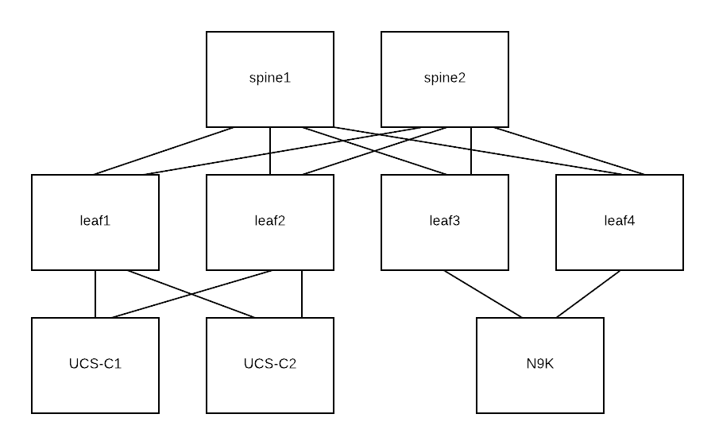

.. sectnum::

ACI Troubleshooting Lab
=======================

Welcome to ACI Troubleshoot Lab documentation

Physical Topology
--------------------

This lab documentation uses the following physical connectivity.

Table of Contents
-----------------

.. toctree::
   :maxdepth: 2

   fabric-discovery
   access-policy
   epg
   contract
   ep-learning
   l3out
   vmm

Indices and tables
==================

* :ref:`genindex`
* :ref:`modindex`
* :ref:`search`

Attachments
===========

Here is a link to a lab excerside attachment__.

__ attachment:aci-tshoot-lab.docx
