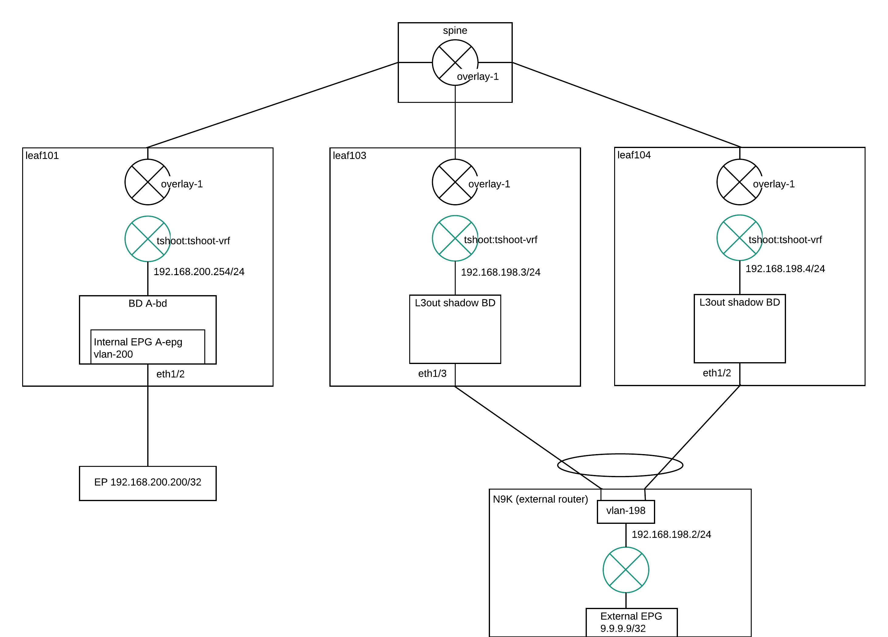
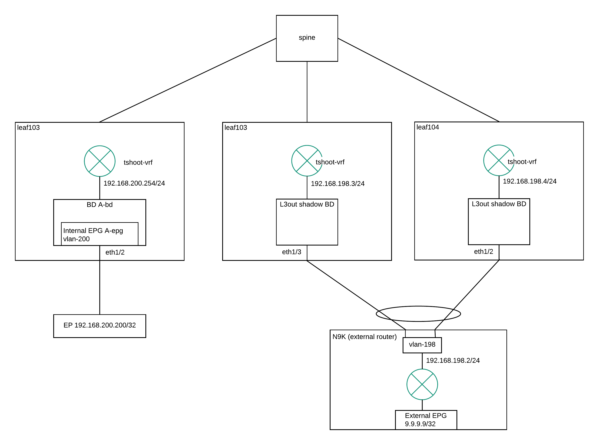
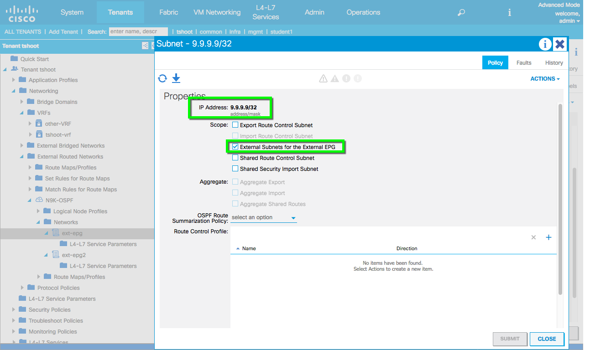

L3out
=====

Lab Topology
-------------

Troubleshooting
----------------

This is a test.

There several points to verify during troubleshooting:

* Fabric Policy – BGP Route Reflector
* BD and L3out association
* BD subnet advertised externally
* L3out - External EPG
* Contract between Internal EPG and External EPG

To check whether BGP route reflector has been configured, we can check the BGP VPNV4 neigborship in vrf overlay-1. 10.0.32.90 is the spine which is configured as a BGP route reflector.

.. code-block:: console

	leaf103# show bgp vpnv4 unicast summary vrf overlay-1
	BGP summary information for VRF overlay-1, address family VPNv4 Unicast
	BGP router identifier 10.0.32.92, local AS number 6500
	BGP table version is 47, VPNv4 Unicast config peers 1, capable peers 1
	6 network entries and 8 paths using 1032 bytes of memory
	BGP attribute entries [2/288], BGP AS path entries [0/0]
	BGP community entries [0/0], BGP clusterlist entries [1/4]

	Neighbor        V    AS MsgRcvd MsgSent   TblVer  InQ OutQ Up/Down  State/PfxRcd
	10.0.32.90      4  6500     400     407       47    0    0 06:22:35 2         

To check whether the external routes from external EPGs has been learnt in BGP VPNV4:

.. code-block:: console

	leaf103# show bgp vpnv4 unicast vrf overlay-1
	BGP routing table information for VRF overlay-1, address family VPNv4 Unicast
	BGP table version is 47, local router ID is 10.0.32.92
	Status: s-suppressed, x-deleted, S-stale, d-dampened, h-history, *-valid, >-best
	Path type: i-internal, e-external, c-confed, l-local, a-aggregate, r-redist
	Origin codes: i - IGP, e - EGP, ? - incomplete, | - multipath

	   Network            Next Hop            Metric     LocPrf     Weight Path
	Route Distinguisher: 10.0.32.91:2
	*>i192.168.198.0/24   10.0.32.91               0        100          0  ?
	*>i9.9.9.9/32         10.0.32.91               5        100          0  ?

	Route Distinguisher: 10.0.32.92:2     (VRF tshoot:tshoot-vrf)
	*>r192.168.197.0/24   0.0.0.0                  0        100      32768  ?
	*>r192.168.198.0/24   0.0.0.0                  0        100      32768  ?
	* i                   10.0.32.91               0        100          0  ?
	*>r192.168.200.0/24   0.0.0.0                  0        100      32768  ?
	*>r9.9.9.9/32         0.0.0.0                  5        100      32768  ?
	* i                   10.0.32.91               5        100          0  ?

First, we need to know the VRF VXLAN Network ID (VNI):

.. code-block:: console

	leaf103# show system internal epm vrf all
	+--------------------------------+--------+----------+----------+------+--------
	               VRF                  Type    VRF vnid  Context ID Status Endpoint
	                                                                          Count 
	+--------------------------------+--------+----------+----------+------+--------
	 tshoot:tshoot-vrf                Tenant   2949120    6          Up     6       

To check the EPG source class (sclass) ID for external EPGs which are classified based on source IP addresses:

.. code-block:: console

	leaf103# vsh_lc
	module-1# show system internal aclqos prefix

	Vrf Vni Addr           Mask     Scope Class  Shared Remote

	======= ============== ======== ===== ====== ====== ======
	2719745 0::/0 0::/0 3     15     FALSE FALSE
	2719745 0.0.0.0        ffffffff 3     15     FALSE FALSE
	2949120 0::/0 0::/0 4     15     FALSE FALSE
	2949120 0.0.0.0        ffffffff 4     15     FALSE FALSE
	2949120 9.9.9.9        0        4     16388  FALSE FALSE <<< External EPG

	Shared Addr    Mask     Scope Class  RefCnt

	============== ======== ===== ====== ======
	module-1# 

The sclass of external EPG 9.9.9.9/32 is 16388.

To check existing BD subnets (pervasive gateways):

.. code-block:: console

   apic# moquery -c fvSubnet

   
