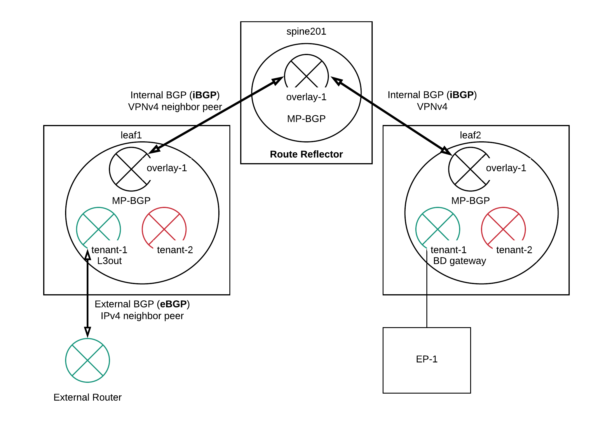

L3out
=====

Lab Topology
-------------

.. image:: l3out-topo.png
   :width: 700px
   :alt: L3out Lab Topology

Troubleshooting
----------------

L3out configuration checklist:

* L3out - External EPG
* Contract between Internal EPG and External EPG
* BD subnet advertised externally and L3out association
* Fabric Policy – BGP Route Reflector

L3out - External EPG
~~~~~~~~~~~~~~~~~~~~

The indication that the external EPG has been correctly configured is the L3out shadow BD is deployed to the border leaf switches.

.. code-block:: console

	leaf103# show vlan extended | grep vlan-198
	VLAN Name                             Status    Ports                           
	---- -------------------------------- --------- -------------------------------  
	9    enet  CE         vxlan-14974940, vlan-198        

VLAN 198 has been mapped to platform independent VLAN 9 on leaf103.

.. code-block:: console

	leaf103# show vlan id 9

	 VLAN Name                             Status    Ports                           
	 ---- -------------------------------- --------- ------------------------------- 
	 9    tshoot:tshoot-vrf:l3out-N9K-     active    Eth1/3, Po1 
	      OSPF:vlan-198                                          

	 VLAN Type  Vlan-mode  
	 ---- ----- ---------- 
	 9    enet  CE       

	leaf103# show system internal epm vlan all | grep 9   
	+----------+---------+-----------------+----------+------+----------+-----------
	   VLAN ID    Type      Access Encap     Fabric    H/W id  BD VLAN    Endpoint  
	                        (Type Value)     Encap                          Count   
	+----------+---------+-----------------+----------+------+----------+----------- 
	 9            Ext. BD 802.1Q        198 14974940   19     9          1      

We can see that the L3out shadow BD has been deployed with Access Encap Vlan 198 and Fabric Encap (VxLAN ID) 14974940.

Contract between Internal EPG and External EPG
~~~~~~~~~~~~~~~~~~~~~~~~~~~~~~~~~~~~~~~~~~~~~~~

Applying a contract to the internal EPG and the external EPG will create zoning-rules and pervasive static route:

.. code-block:: console

	leaf103# show ip route vrf tshoot:tshoot-vrf  
	192.168.200.0/24, ubest/mbest: 1/0, attached, direct, pervasive
	    *via 10.0.64.64%overlay-1, [1/0], 00:38:14, static

To check the EPG source class (sclass) ID for external EPGs which are classified based on source IP addresses:

.. image:: external-epg.png
   :width: 700px
   :alt: External EPG

We need to know the VRF VXLAN Network ID (VNI):

.. code-block:: console

	leaf103# show system internal epm vrf all
	+--------------------------------+--------+----------+----------+------+--------
	               VRF                  Type    VRF vnid  Context ID Status Endpoint
	                                                                          Count 
	+--------------------------------+--------+----------+----------+------+--------
	 tshoot:tshoot-vrf                Tenant   2949120    6          Up     6     

.. code-block:: console

	leaf103# vsh_lc
	module-1# show system internal aclqos prefix

	Vrf Vni Addr           Mask     Scope Class  Shared Remote

	======= ============== ======== ===== ====== ====== ======
	2719745 0::/0 0::/0 3     15     FALSE FALSE
	2719745 0.0.0.0        ffffffff 3     15     FALSE FALSE
	2949120 0::/0 0::/0 4     15     FALSE FALSE
	2949120 0.0.0.0        ffffffff 4     15     FALSE FALSE
	2949120 9.9.9.9        0        4     16388  FALSE FALSE <<< External EPG

	Shared Addr    Mask     Scope Class  RefCnt

	============== ======== ===== ====== ======
	module-1# 

The sclass of external EPG 9.9.9.9/32 is 16388.

To check the zoning rule (contract), we need to check on the compute leaf:

.. code-block:: console

	leaf101# show zoning-rule scope 2949120 | grep 16388 
	4221            49156           16388           default         enabled         2949120         permit                              src_dst_any(9) 
	4222            16388           49156           default         enabled         2949120         permit                              src_dst_any(9) 

BD subnet advertised externally and L3out association
~~~~~~~~~~~~~~~~~~~~~~~~~~~~~~~~~~~~~~~~~~~~~~~~~~~~~~

To check whether the BD subnet is externally advertised and associated to the L3out:

.. code-block:: console

	leaf103# show ip ospf vrf  tshoot:tshoot-vrf 
	...
	 Redistributing External Routes from
	   static route-map exp-ctx-st-2949120

	leaf103# show route-map exp-ctx-st-2949120
	route-map exp-ctx-st-2949120, deny, sequence 1 
	  Match clauses:
	    tag: 4294967295
	  Set clauses:
	route-map exp-ctx-st-2949120, permit, sequence 15801 
	  Match clauses:
	    ip address prefix-lists: IPv4-st16388-2949120-exc-int-inferred-export-dst
	    ipv6 address prefix-lists: IPv6-deny-all
	  Set clauses:

	leaf103# show ip prefix-list IPv4-st16388-2949120-exc-int-inferred-export-dst
	ip prefix-list IPv4-st16388-2949120-exc-int-inferred-export-dst: 1 entries
	   seq 1 permit 192.168.200.254/24 

We can see that subnet 192.168.200.254/24 is permited to be redistibuted from static to OSPF.

Fabric Policy – BGP Route Reflector
~~~~~~~~~~~~~~~~~~~~~~~~~~~~~~~~~~~~

To check whether BGP route reflector has been configured, we can check the BGP VPNV4 neigborship in vrf overlay-1. 10.0.32.90 is the spine which is configured as a BGP route reflector.

.. code-block:: console

	leaf103# show bgp vpnv4 unicast summary vrf overlay-1
	BGP summary information for VRF overlay-1, address family VPNv4 Unicast
	BGP router identifier 10.0.32.92, local AS number 6500
	BGP table version is 47, VPNv4 Unicast config peers 1, capable peers 1
	6 network entries and 8 paths using 1032 bytes of memory
	BGP attribute entries [2/288], BGP AS path entries [0/0]
	BGP community entries [0/0], BGP clusterlist entries [1/4]

	Neighbor        V    AS MsgRcvd MsgSent   TblVer  InQ OutQ Up/Down  State/PfxRcd
	10.0.32.90      4  6500     400     407       47    0    0 06:22:35 2         

To check whether the external routes from external EPGs has been learnt in BGP VPNV4:

.. code-block:: console

	leaf103# show bgp vpnv4 unicast vrf overlay-1
	BGP routing table information for VRF overlay-1, address family VPNv4 Unicast
	BGP table version is 47, local router ID is 10.0.32.92
	Status: s-suppressed, x-deleted, S-stale, d-dampened, h-history, *-valid, >-best
	Path type: i-internal, e-external, c-confed, l-local, a-aggregate, r-redist
	Origin codes: i - IGP, e - EGP, ? - incomplete, | - multipath

	   Network            Next Hop            Metric     LocPrf     Weight Path
	Route Distinguisher: 10.0.32.91:2
	*>i192.168.198.0/24   10.0.32.91               0        100          0  ?
	*>i9.9.9.9/32         10.0.32.91               5        100          0  ?

	Route Distinguisher: 10.0.32.92:2     (VRF tshoot:tshoot-vrf)
	*>r192.168.197.0/24   0.0.0.0                  0        100      32768  ?
	*>r192.168.198.0/24   0.0.0.0                  0        100      32768  ?
	* i                   10.0.32.91               0        100          0  ?
	*>r192.168.200.0/24   0.0.0.0                  0        100      32768  ?
	*>r9.9.9.9/32         0.0.0.0                  5        100      32768  ?
	* i                   10.0.32.91               5        100          0  ?

BD Subnets
~~~~~~~~~~~  

To check existing BD subnets:

.. code-block:: console

   apic# moquery -c fvSubnet

   
