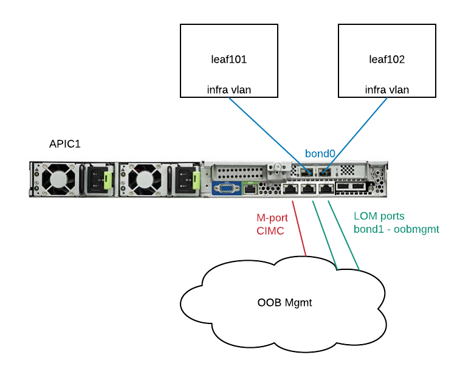

Fabric Discovery
================

Physical Topology
-----------------
.. image:: physical-topo.png
   :width: 500px
   :alt: Physical 

APIC1 Connectivity
------------------

To erase configuration so that we can re-setup APIC::
  acidiag touch setup
  acidiag reboot

+---------------+-----------------+----------+----------+
|               | APIC 1          | APIC 2   | APIC 3   |
+===============+=================+==========+==========+
| IP address    | 10.66.88.181/27 | column 3 | column 4 |
+---------------+-----------------+----------+----------+
| Gateway       | 10.66.88.161    | ...      |          |
+---------------+-----------------+----------+----------+

Check which active interface is connected to the leaf::

  apic1# cat /proc/net/bonding/bond0
  Ethernet Channel Bonding Driver: v3.7.1 (April 27, 2011)

  Bonding Mode: fault-tolerance (active-backup)
  Primary Slave: None
  Currently Active Slave: eth2-2
  MII Status: up
  MII Polling Interval (ms): 60
  Up Delay (ms): 0
  Down Delay (ms): 0
  
  Slave Interface: eth2-1
  MII Status: down
  Speed: Unknown
  Duplex: Unknown
  Link Failure Count: 0
  Permanent HW addr: 58:f3:9c:24:32:fd
  Slave queue ID: 0

  Slave Interface: eth2-2
  MII Status: up <<<<<<<<<< This status indicates eth2-2 is active 
  Speed: 10000 Mbps
  Duplex: full
  Link Failure Count: 1
  Permanent HW addr: 58:f3:9c:24:32:fe
  Slave queue ID: 0

Check the lldp neighbours on APIC1::

  apic1# acidiag run lldptool in eth2-2
  Port Description TLV
          topology/pod-1/paths-101/pathep-[eth1/45]
  Cisco Infra VLAN TLV
          4094

Check the lldp neighbours on connected Leaf::
  switch# show lldp neighbor
 
If the lldp neigbor empty or showing mac address, that means the LLDP is enabled on the VIC card of APIC. As a result, the VIC consumes the LLDP and the APIC cannot respond. To disable LLDP on VIC:

SSH as user admin to CIMC of the APIC ::

  CIMC# scope chassis
  CIMC /chassis # show adapter
  PCI Slot Product Name Serial Number Product ID Vendor
  -------- -------------- -------------- -------------- --------------------
  1 UCS VIC 1225 FCHxxxxxxxx UCSC-PCIE-C... Cisco Systems Inc
  CIMC /chassis # scope adapter 1
  CIMC /chassis/adapter # show detail | grep LLDP
  LLDP: Enabled
  CIMC /chassis/adapter # set lldp disabled
  CIMC /chassis/adapter *# commit
  New VNIC adapter settings will take effect upon the next server reset
  CIMC /chassis/adapter # exit
  CIMC /chassis # power cycle

Source: https://supportforums.cisco.com/legacyfs/online/attachments/document/files/apic-vic-lldp-fn.pdf
