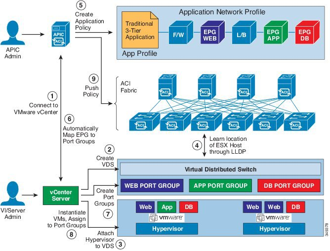

Virtual Machine Manager Domain
===========================================

Resolution Immediacy
--------------------

* Pre-provision—Specifies that a policy (for example, VLAN, VXLAN binding, contracts, or filters) is downloaded to a leaf switch even before a VM controller is attached to the virtual switch (for example, VMware VDS). This pre-provisions the configuration on the switch. This helps the situation where management traffic for hypervisors/VM controllers are also using the virtual switch associated to APIC VMM domain (VMM switch). Deploying a VMM policy such as VLAN on ACI leaf switch requires APIC to collect CDP/LLDP information from both hypervisors via VM controller and ACI leaf switch. However if VM Controller is supposed to use the same VMM policy (VMM switch) to communicate with its hypervisors or even APIC, the CDP/LLDP information for hypervisors can never be collected because the policy required for VM controller/hypervisor management traffic is not deployed yet. When using pre-provision immediacy, policy is downloaded to ACI leaf switch regardless of CDP/LLDP neighborship. Even without a hypervisor host connected to the VMM switch.
* Immediate—Specifies that EPG policies (including contracts and filters) are downloaded to the associated leaf switch software upon ESXi host attachment to a DVS. LLDP or OpFlex permissions are used to resolve the VM controller to leaf node attachments. The policy will be downloaded to leaf when you add host to the VMM switch. CDP/LLDP neighborship from host to leaf is required.
* On Demand—Specifies that a policy (for example, VLAN, VXLAN bindings, contracts, or filters) is pushed to the leaf node only when an ESXi host is attached to a DVS and a VM is placed in the port group (EPG). The policy will be downloaded to leaf when host is added to VMM switch and virtual machine needs to be placed into port group (EPG). CDP/LLDP neighborship from host to leaf is required. With both immediate and on demand, if host and leaf lose LLDP/CDP neighborship the policies are removed.

Deployment Immediacy
---------------------

* Once the policies are downloaded to the leaf software, deployment immediacy can specify when the policy is pushed into the hardware policy content-addressable memory (CAM).
* Immediate—Specifies that the policy is programmed in the hardware policy CAM as soon as the policy is downloaded in the leaf software. On demand—Specifies that the policy is programmed in the hardware policy CAM only when the first packet is received through the data path. This process helps to optimize the hardware space.

Reference
----------
#. VMM Domain https://www.cisco.com/c/en/us/td/docs/switches/datacenter/aci/apic/sw/1-x/aci-fundamentals/b_ACI-Fundamentals/b_ACI-Fundamentals_chapter_01011.html
